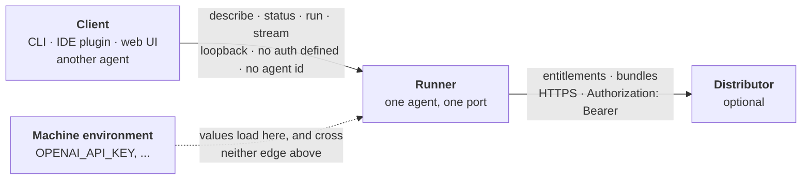

# Postern

**The open execution and entitlement protocol for packaged AI agents** — a
small HTTP contract for running one as a local process, and for checking
that whoever is running it is allowed to.

*A postern is the small gate in a fortification that authorised people pass
through. Present proof, pass through, then run.*

📄 **[Read the specification →](SPEC.md)** · Version 0.1 · Draft ·
[Apache-2.0](LICENSE)

---

## What problem this solves

You bought or downloaded an AI agent. It is a folder on your machine. Now
what?

Today the answer is different for every agent: read its README, install its
dependencies, find out what it expects as input, work out how to run it,
discover afterwards which API keys it needed. Every client that wants to
offer a nicer experience than a terminal has to hard-code that knowledge per
agent, which means nobody does it.

Postern fixes the interface, not the agent. An agent that speaks Postern can
say what it takes and produce what it returns, over four HTTP endpoints:

| Verb | Does |
|---|---|
| `describe` | What inputs does this take, what does it return, which credentials does it need, which of its tools cost money |
| `run` | Run it, give me the result |
| `stream` | Run it, show me as it goes |
| `status` | Is it healthy, am I still allowed to run it |

Anything that can call HTTP can be a client — a CLI, an IDE plugin, a web
UI, another agent. Anything that can serve HTTP can be an agent, in any
language. No SDK is required, and none is planned; if you want one for your
language, the specification is right there and pull requests are welcome.

A web UI is the one of those with a condition attached, because a browser
will not let a page read a local runner's answer unless the runner allows
the page's origin. [§2.3](SPEC.md#23-browser-clients) says what a runner
owes a browser client, and why the default is to refuse: a runner defines
no authentication, so an origin check is the only thing standing between
`run` and every page the user happens to visit.



The dotted edge is the one that carries no protocol traffic, and it is the
subject of the next two sections. More diagrams, including the entitlement
state machine, are in [`docs/`](docs).

## What it does not do

Postern does not define a packaging format. Agents are packaged as [Agent
Plugins v1.0.0](https://agent-plugins.org) plugins — the vendor-neutral
standard governed by Amazon, Microsoft, OpenAI, Cursor, Vercel and Google.
Postern adds no files to that layout.

It also does not define tool calling (use
[MCP](https://modelcontextprotocol.io)), model APIs, agent frameworks,
orchestration between agents, or hosting.

**Four verbs is a ceiling, not a starting point.** A protocol that can be
kept compatible by a small team beats a complete one that cannot. See
[VERSIONING.md](VERSIONING.md).

## The part nobody else specifies

Agent Plugins v1.0.0 says of itself that *licensing is metadata only; no
portable verification mechanism defined.* MCP does not address it either.

So if you sell an agent, or run one you paid for, there is no standard
answer to "how does this thing check I'm entitled to it, and what happens
when I get a refund." [§5 of the specification](SPEC.md#5-entitlement) is
that answer: opaque bearer tokens, hashed at rest, a per-agent check with a
declared staleness bound, and a rule that revocation windows must be
published rather than pretended away.

Two properties of that design are worth stating up front, because they are
constraints on implementers rather than features:

- **Credentials never traverse the protocol.** An agent declares the
  environment variable *names* it needs. A bundle carrying a credential
  *value* is nonconformant. There is nowhere in Postern for a secret to travel,
  which is what makes "your keys stay on your machine" checkable instead of
  promised.
- **Not-entitled is indistinguishable from not-found.** A distributor
  answers `404`, never `403`, so the entitlement endpoint cannot be used to
  enumerate a private catalogue. This costs a legitimate caller a worse
  error message, on purpose.

An agent that is free, self-authored, or local has no distributor and skips
all of this.

## Level 1 in fifteen minutes

Two `GET`s and one refusal are a conforming runner. That is the whole of
Level 1 for an agent with no distributor, which is every agent that is
free, self-authored, or local:

| Route | Answers |
|---|---|
| `GET /postern/v0/describe` | what the agent takes and what it returns |
| `GET /postern/v0/status` | its level, its state, and `not_required` for the entitlement |
| `POST /postern/v0/run`, `POST /postern/v0/stream` | `501` with `not_implemented`, being above Level 1 |
| `OPTIONS` on `run` and `stream` | `204`, carrying `Access-Control-Allow-Origin` only for an origin you configured |

The smallest `describe` that validates:

```json
{
  "postern": "0.1",
  "agent": {"id": "you/hello", "name": "Hello", "version": "0.1.0"},
  "inputs": [
    {"key": "prompt", "label": "What to say", "type": "text", "required": true}
  ],
  "output": {"type": "text"}
}
```

and the smallest `status`:

```json
{
  "postern": "0.1",
  "level": 1,
  "state": "ready",
  "agent": {"id": "you/hello"},
  "entitlement": {"state": "not_required"}
}
```

Both are `application/json; charset=utf-8`, both answer without
credentials, and neither changes anything. Every non-2xx answer under
`/postern/v0/` — a verb above your level, a path you do not serve — carries
the one error envelope:

```json
{"error": {"code": "not_implemented", "message": "This runner serves Level 1.", "detail": null}}
```

Four `curl` lines exercise all of it:

```console
curl -s http://127.0.0.1:8787/postern/v0/describe
curl -s http://127.0.0.1:8787/postern/v0/status
curl -s -X POST http://127.0.0.1:8787/postern/v0/run \
     -H 'Content-Type: application/json; charset=utf-8' \
     -d '{"inputs": {"prompt": "hello"}}'          # 501 at Level 1, 200 at Level 2
curl -s -N -X POST http://127.0.0.1:8787/postern/v0/stream \
     -H 'Content-Type: application/json; charset=utf-8' \
     -d '{"inputs": {"prompt": "hello"}}'          # 501 below Level 3, events at Level 3
```

Then point the checker at it (below) before reading anything past §4.

**Level 2 adds `run`, and one table.** A `run` can earn several refusals at
once, and [§4.6](SPEC.md#46-the-order-of-refusals) fixes which one wins:

| | Check | Refusal |
|---|---|---|
| 1 | the verb is above your level | `501` `not_implemented` |
| 2 | the entitlement is not in force | `403` `not_entitled` or `503` `unavailable` — a row you skip with no distributor |
| 3 | the body's media type is not `application/json` | `400` `bad_request` |
| 4 | a required input is missing, or a declared validation fails | `400` `bad_request` |
| 5 | a credential `describe` declares is not in your environment | `424` `missing_credential` |

**Level 3 adds `stream`**: the same request body, answered as
`text/event-stream` with `start` first and exactly one `done` or `error`
last ([§4.3](SPEC.md#43-post-posternv0stream)). A browser cannot read it
with `EventSource`, which only issues `GET`; it reads the response body
itself, and this is all that takes:

```js
const res = await fetch("http://127.0.0.1:8787/postern/v0/stream", {
  method: "POST",
  headers: {"Content-Type": "application/json; charset=utf-8"},
  body: JSON.stringify({inputs: {prompt: "hello"}}),
});
const reader = res.body.pipeThrough(new TextDecoderStream()).getReader();
let buffer = "", event = "", data = [];
while (true) {
  const {value, done} = await reader.read();
  if (done) break;
  buffer += value;
  let end;
  while ((end = buffer.indexOf("\n")) !== -1) {
    const line = buffer.slice(0, end).replace(/\r$/, "");
    buffer = buffer.slice(end + 1);
    if (line === "") {
      if (data.length) handle(event || "message", JSON.parse(data.join("\n")));
      event = ""; data = [];
    } else if (line.startsWith("event:")) {
      event = line.slice(6).trim();
    } else if (line.startsWith("data:")) {
      data.push(line.slice(5).replace(/^ /, ""));
    } // a ":" comment line is a keepalive; "id:" and "retry:" mean nothing here
  }
}
```

`handle` receives `start`, `step`, `delta`, `done` and `error`, and ignores
any name it does not know. The same walk in Python — `status` for the
level, `describe` for the inputs, then `run` or `stream` — is
[`examples/client.py`](examples/client.py), standard library only.

**What binds a runner with no distributor** is §2, §2.1, §2.3, §3, §4.1 and
§4.4 at Level 1; §4.2, §4.5 and §4.6 from Level 2; §4.3 at Level 3. All of
[§5](SPEC.md#5-entitlement) binds only a runner configured with a
distributor, and it is a quarter of the document. Run the checker before
you read it.

## Conformance

Three cumulative levels, so an agent that cannot stream — or cannot be run
by the caller at all — is still conformant and still describable:

| Level | Name | Verbs |
|---|---|---|
| 1 | Describe | `describe`, `status` |
| 2 | Execute | + `run` |
| 3 | Stream | + `stream` |

Machine-readable schemas are in [`schemas/`](schemas), worked payloads in
[`examples/`](examples), and diagrams of the whole surface in
[`docs/`](docs).

Which level a runner *actually* reaches is a question you can ask it:

```console
pip install postern-conformance
postern-conformance http://127.0.0.1:8787
```

[`tools/conformance/`](tools/conformance) points at a running runner and
reports which of the three levels it meets, and which MUST rules it breaks
getting there. It checks over the wire, so it reads a Go or Rust runner as
well as a Python one, and it does not run your agent unless you pass
`--execute` — a run may spend money ([§4.1.2](SPEC.md#412-capabilitieswrite_tools))
and an abort is not a rollback ([§4.5](SPEC.md#45-the-life-of-a-run)), so
most of the specification is checked through refusals that execute nothing.

It is a test suite, not an SDK, and not a reference implementation.

## Status

**This is a draft, and nothing in it is stable yet.** Version 0.1 is drafted
in the open, deliberately: a specification benefits most from being read
while changing it is still free. It is not released — there is no `spec-v*`
tag to pin to, and until there is, changes land under *Unreleased* rather
than moving the version. The `conformance-v*` tags this repository does
carry release the checker in `tools/conformance/`, not the specification
([VERSIONING.md](VERSIONING.md)). Breaking changes will happen before 1.0, and
[VERSIONING.md](VERSIONING.md) says which of them move what.

There is no reference implementation in this repository. There is one
elsewhere: [Sigrix](https://sigrix.io) serves the four verbs at Level 3 for a
packaged agent, and the §5 endpoints as a distributor.

It is an implementation of this document rather than a second definition of
it — where the two appear to disagree, this document is what anyone pinned to,
and the disagreement is worth an issue here.

If you are building against this, please [open an
issue](../../issues) — knowing who depends on what is what lets us avoid
breaking you.

## Contributing

Issues and pull requests are welcome. Please read
[CONTRIBUTING.md](CONTRIBUTING.md) first — in particular the part about how
quickly you can expect an answer, which is written to be accurate rather
than flattering.

## License

[Apache-2.0](LICENSE). Published by [Sigrix](https://sigrix.io).
