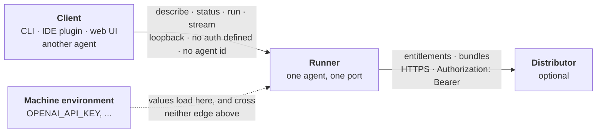
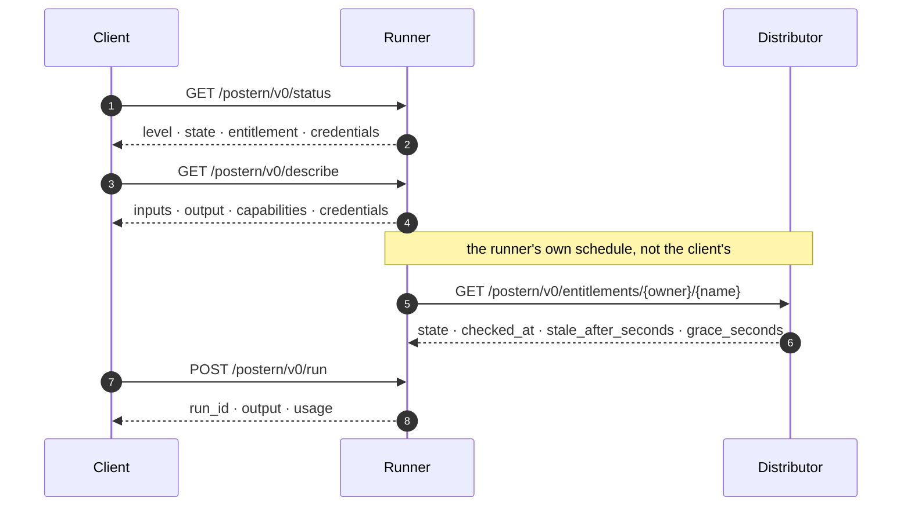
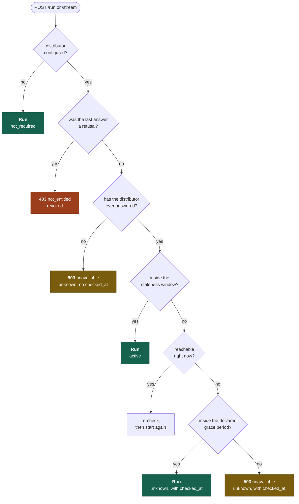
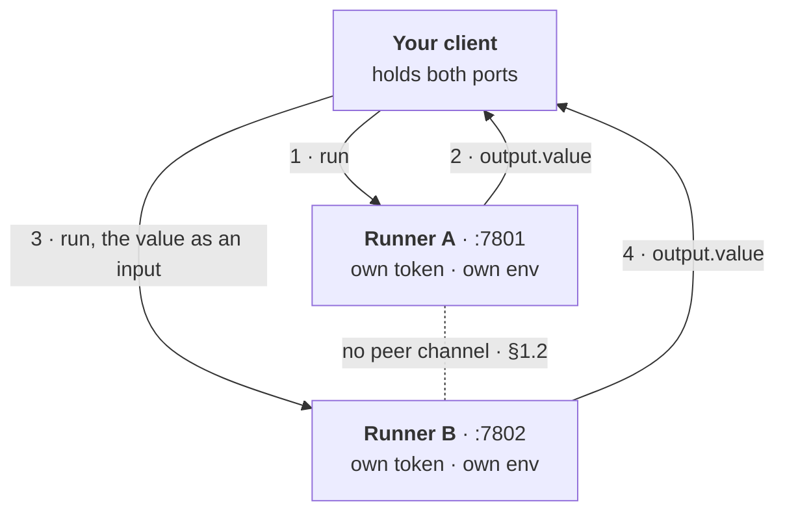
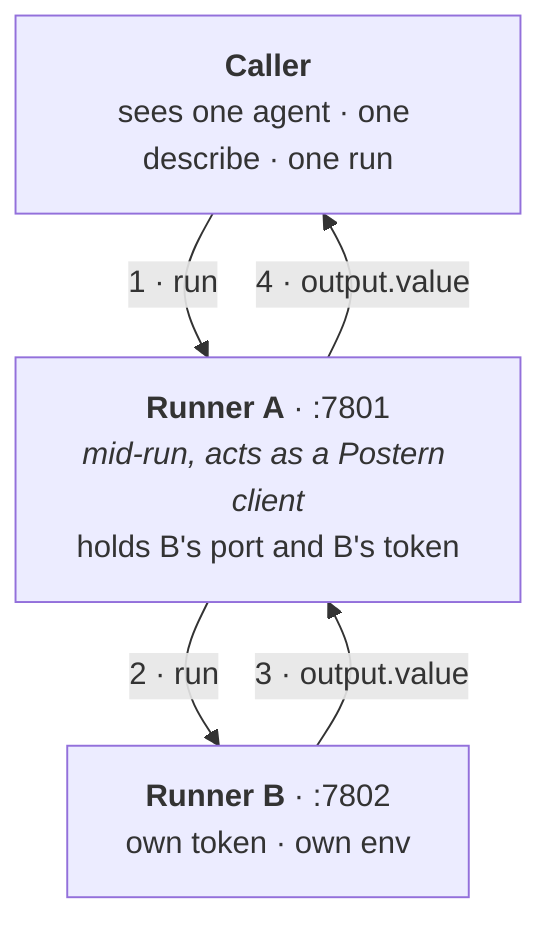
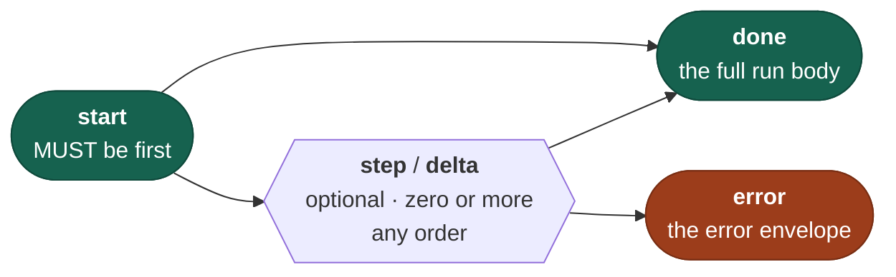
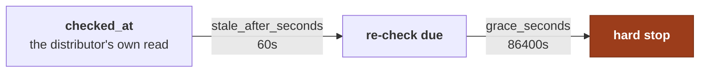

# Postern in pictures

Seven diagrams of [SPEC.md](../SPEC.md), for a reader deciding whether Postern is
for them before committing to 2,031 lines of prose.

> [!NOTE]
> **Non-normative.** Nothing on this page adds to the protocol, constrains an
> implementation, or is safe to build against on its own. Where a picture and the
> specification disagree, the specification is right. Every section reference
> points at the text that actually governs — `scripts/validate.py` checks that
> those references resolve, so a renumbered section breaks the build rather than
> the reader.

---

## 1 · Two surfaces, joined at the runner

Postern looks like one protocol and behaves like two, with opposite security
models, meeting in a single process.

Everything a client touches is unauthenticated, loopback-bound, and carries no
agent identifier at all — §2.2 makes the port the agent's address, so a runner
serves exactly one agent. Everything the runner touches upstream is the inverse.

The dotted edge is the one that carries no protocol traffic. §4.1.3 lets
`describe` declare credential *names* and forbids any payload or bundle from
carrying a *value*, which is what makes "your keys stay on your machine"
checkable rather than promised.

---

## 2 · What a client does

No ordering is mandated, but this is the one where a client knows what it is
doing before it does it: `status` reports the conformance level (§3), so a client
learns whether `run` exists at all, and `describe` reports the input contract.

Both answer at Level 1 and both answer without an entitlement, which is what lets
a client render an agent it cannot yet run. Only `run` and `stream` can be
refused on entitlement grounds.

---

## 3 · When a run is allowed

§5 is the part of Postern that has no equivalent elsewhere, and the part an
implementer most has to get right. Its rules are spread across five sub-sections
and collected as a table; asked in order, they are one walk with three endings.

The rule underneath the whole chart, and the one to apply to a case it does not
list: **unreachable answers `unavailable`, refused answers `not_entitled`**
(§5.7.4). A runner that cannot find out invites a retry; a runner that has been
told no does not pretend the answer might change.

Two branches are easy to get backwards. A `404` from the check is an *answer*,
not an outage, so it refuses immediately with no grace (§5.7.4) — which is why
the refusal question is asked before the never-answered one. And `describe` and
`status` keep answering down every branch: a runner that cannot run its agent
still says what it is and what is wrong (§4.1, §4.4).

---

## 4 · Two components, chained by the client

The most common question about Postern, and §1.2 answers it in a way that is
easy to misread: *"orchestration between agents" means the choreography, not the
call.* Agents compose. What is out of scope is how they discover one another,
hand off, share state, or delegate authority.

Two components means two runners on two ports — §2.2 permits no other shape. The
client carries the value across, and that works with no adapter because §4.1.4
makes `text` the v0 output type by decision and inputs take strings (§4.1.1).
The reserved key `prompt` denotes a single free-text brief where an agent has
one, which is the natural landing spot for a chained value.

### Or: the agent holds the client role

§1.2 permits this outright — an agent may itself be a Postern client, and one agent
calling another is two ordinary relationships rather than an exception. The
composition moves into an agent you ship instead of an app you write.

You gain one surface for the caller, and nobody can wire the chain up wrongly.
What it costs is worth knowing before you choose it:

- **A refusal on B arrives as `agent_error`.** §2.1 reserves `403 not_entitled` for a
  runner reporting its *own* state, so A cannot honestly relay B's. The caller gets a
  `500` and no way to learn that an entitlement was the cause.
- **The dependency is invisible in `describe`.** No field declares "I call another
  Postern agent". The closest honest home is `capabilities.tools`, and `write_tools`
  if reaching B spends money (§4.1.2).
- **B's spend is not in A's `usage`.** `usage.cost_usd` is a runner's estimate of its
  own run, so a caller summing runs under-counts.
- **Streams must be merged, not forwarded.** §4.3 binds A: concatenating every
  `delta.text` it emits must equal *A's* final `output.value`.

Pick the client-orchestrated shape when both components are independently useful and
the caller should see both. Pick this one when they only make sense together — and
accept that failures inside the chain lose their names on the way out.

---

## 5 · The stream contract

Exactly one `done` or one `error`, last. A client must ignore an event name it
does not recognise rather than aborting, which is how the list grows without a
version bump (§4.3).

The invariant that makes the stream worth consuming: if any `delta` is emitted,
concatenating every `delta.text` in order equals the final `output.value`. A
client can render deltas as they arrive and trust that what it displayed is what
it will be handed. A runner that cannot produce incremental text emits none —
`start` then `done` is a conformant Level 3 stream.

Where a runner breaks the invariant anyway, the client prefers `done`'s
`output.value` and does not call the run failed: the run succeeded and the
rendering of it was wrong, which are two different facts (§4.3).

---

## 6 · Where Sigrix fits

Postern is published by [Sigrix](https://sigrix.io), and §8 is a *profile* — normative
for Sigrix as a distributor, informative for everyone else. Postern is usable with no
reference to it.

**No Sigrix endpoint is specified, anywhere.** The two distributor paths are written
`{distributor}/postern/v0/…`, and that base is a runner's configuration; the
specification never binds it to a host. `sigrix.io` carries the schema `$id` names and
the contact addresses, and neither is a protocol endpoint —
[VERSIONING.md](../VERSIONING.md) states outright that *nothing in the protocol
requires a Sigrix service*. Sigrix is one **instance** of the Distributor box in
diagram 1, not a fifth party.

What §8 does pin down:

| | |
|---|---|
| Bundle namespace | `org.sigrix`, carrying `agent_id` and `listing_url` (§6) |
| Tokens | 32 random bytes, URL-safe base64, SHA-256 at rest; one active token per buyer, and rotation revokes every predecessor |
| Declared window | `stale_after_seconds` 60, `grace_seconds` 86400 |
| Withdrawal | `410 withdrawn`, with a twelve-month tail for buyers who owned the listing (§5.6) |

Those two numbers are what diagram 3 branches on, and §5.4 makes their **sum** the
honest bound rather than either alone:

So a revoked Sigrix entitlement can keep working for at most **86,460 seconds — just
over 24 hours**. Both terms are the distributor's own, so the sum is knowable to it
before it publishes either, and §5.4 requires that neither is understated.

`checked_at` being the distributor's *read* time rather than the runner's receipt time
is what keeps that sum honest; [`flow.html`](flow.html) draws the alternative it rules
out.

---

## Where to go next

| | |
|---|---|
| The specification | [SPEC.md](../SPEC.md) — 2,031 lines, and the only thing that governs |
| Machine-readable payloads | [`schemas/`](../schemas), with worked instances in [`examples/`](../examples) |
| What may change before 1.0 | [VERSIONING.md](../VERSIONING.md) |
| A longer illustrated walk-through | [`flow.html`](flow.html) — open it in a browser; it adds the staleness-window and `404`-indistinguishability figures this page leaves out |
